## 第二章： B-Tree Basics
- B+ 树是几乎所有基于磁盘的关系型数据库(mysql， pg等)的基础数据结构
- B+ 树是Binary Search Tree的衍生， 有跟多的fanout, 所以搜索速度会更快（Log2 -> LogK,  当然在它们的算法复杂度是一致的）
- B+树的搜索见下图， 是从root根节点一直往下遍历的
- 数据的增删会触发B+数的split和merge（触发条件就是overflow和underflow）

#### 示意图
B+树（n key， n+1 pointer结构， 当然有些B+树只会在叶子节点存储数据， 然后子节点之间用链表和双向链表来提升查询效率）. 

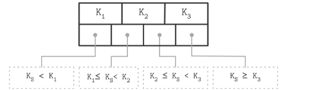

leaf node的split. 

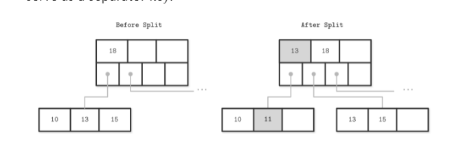

leaf node的merge

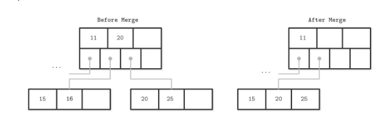

non-leaf node的split

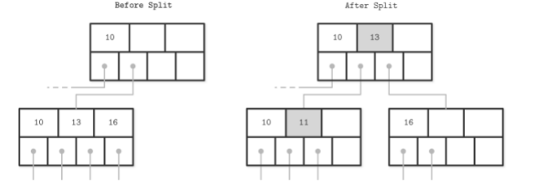

non-leaf node的merge
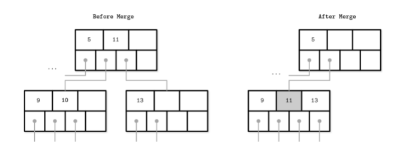

上面也看到了， 树的merge和split是比较耗时的操作(以split为例， 在某些场景下是需要一直向上递归的)， 特别在使用磁盘的场景下， 那么减少这种操作（调度）， 或者该表数据大小（压缩）通常会是优化数据库性能的重要方向

## 第三章 File Formats
基于磁盘存储的数据库， 它的主要的存储单元是Page, 大小一般是4kb-16kb之间， 基本上一个Page对应一个B-Tree的节点
### 原始的Page结构
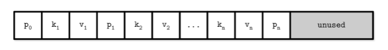

- p： 指针， 指向子节点
- k:  key
- v： value

这种结构非常适合用来存储大小固定的数据， 比如char(13)来存储电话号码(那么所有电话号码都是同样长度的， 这种方式的存储和查找非常的便利)
但是这种方式最大的问题是不好存储存储可变长度的数据， 比如string或者text

### slotted page
现代数据库的page结构， 主要采用的是slotted page的形式：
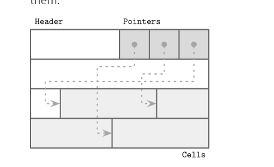  
好处就是解决了原始Page结构不好存储可变长度记录的问题， 同时支持在数据被删除的时候进行更好的再利用（下面会提及）

### Cell
cell存储各种类型的数据，它在Slotted Page中的插入方式是从尾部往前插入， 然后在Header中的Poitner会依次保留各个cell的offet信息

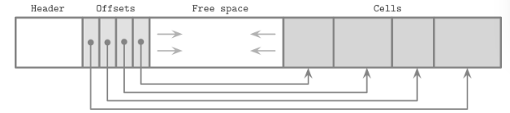  
> 为什么采用这样的插入顺序其实也很好理解， 如果直接从左至右， 每次有一个新的cell, 那么原来存储在最左侧（紧挨着Header）的cell， 由于Header变化了， 它也需要相应地右移， 而从尾部向前则不需要

当然如果要保持Offset的逻辑顺序(比如根据Cell数据的字母序)， 我们可以调整Offset的位置
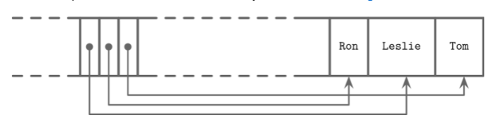  
> 插入顺序： Tom -> Lesile -> Ron， Offsets的顺序则是Lesile -> Ron -> Tom

前面提到了， Slotted Page在空间再利用（reclaim space， 利用被删除的数据）的高效性， 以sqlite db为例， 数据库会维持一份可以用space的指针列表. 
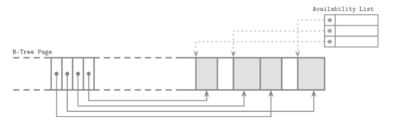  
当要插入新的数据的时候， 会使用First fit或者Best fit算法去找到哪一块空间最最适合插入新数据
> First fit: 找到第一块可以容纳新数据的space
> Best fit：找到浪费最小的space(就是space和新插入数据大小的差值最小)
> 从空间利用率上Best fit会更好，当然First fit速度明显会更快

假设， 没有办法找到任意一块能够容纳新数据的空白space， 并且我的空白space总和又大于新数据， 那这个时候就需要进行去碎片化(defragmenting)

### Cell的结构
cell有两种， 第一种叫做Key Cell， 主要用来存储key。第二种是Key-Value Cell, 就是同时用来存储key和vlaue的， 一个page上面， 通常是这有这两种key中的任意一种的(因为两种key的结构略有不同， 所以从效率角度， 肯定是存储一种类型的会更好). 

Key Cell结构：
- cell type
- key size
- child page id
- key bytes

Key-Value Cell结构:
- cell type
- key size
- value size 
- key bytes
- Data record bytes(也就是value bytes)

## 第四章 Implementing B-Trees
### Page Header
page header会存储一些和page相关的元信息， 除了上前面提到的cell offsets, 还会有诸如：

-  Magic numbers
- sibling links
- rightmost pointers
- node high key

magic numbers是会存储在Page上的的特定位置的二进制的值， 比如存储第51 ， 47， 41， 45位的值， 目的是为了验证page有没有被污染， 只要在读数据的时候， 比较一下这几位的实际值和存储在header中的值是否一样即可
一般来说每个node， 会存储n个key以及n+1 pointer指向这个node的子节点， 这个第n个key经常会被存储在page header
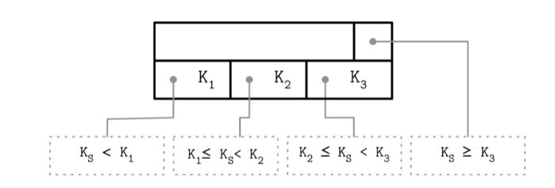  

有时候， 这种方式会有一种变体就是key会饿pointer的数量对齐：
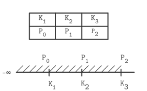  
上面的K3就是high key

### Overflow pages
通常page的size是固定的， 在4-16kb之间， 过大的size不可避免的会照成空间的浪费。 但是page size的固定话， 当可变长的数据过大的时候，我们就需要有一个扩展的页去存储溢出的数据, 这些页就被称为overflow page. 
> 说到底， 磁盘的load reload的开销过大才需要固定size的page， 以及这种overflow page， 如果是内存， 之间原来的size 按比例扩容就好了

page header会保留指向这些overflow page的指针（overflow page也需要保留指向原始页面的指针）
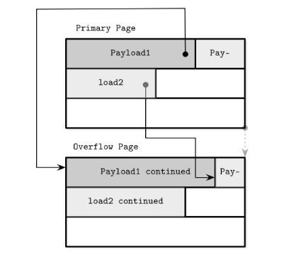  
一般来说说， 一个page只会指向单一的overflow page， 如果还是放不下， 那么可以继续从overlow page出发链接新的overflow page

### 二分查找在页面中应用
由于page header中可以以逻辑顺序保留cell的offsets， 那么我们完全可以对这些offset进行二分查找：
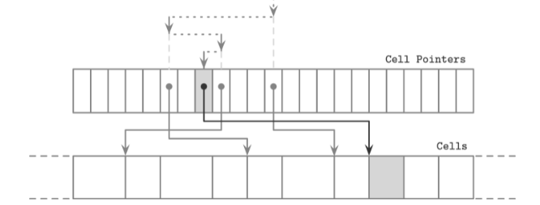  
具体步骤就是， 现取这些offsets中最中间的那个， 然后找到对应的cell， 比较和查找键的大小来决定二分查找的方向是往左还是往右

### 页的Split和Merge的传播
随着数据的插入和删除， B树的节点需要进行相应的拆分 & 合并， 这意味着子节点的父节点以也会发生变化， 而且这种变化通常是一层层向上传播的。有没有一种高效的算法去更新这种变化 ， 其中一种就是Breadcrums（面包屑）， 这个算法的名称其实很形象地指出了它的实现方式：
我们查找新的插入节点， 一定是从根节点之上而下的， 如果我们记录了这个path的话， 那么将其逆序， 不就找到了每个子节点的父节点嘛？
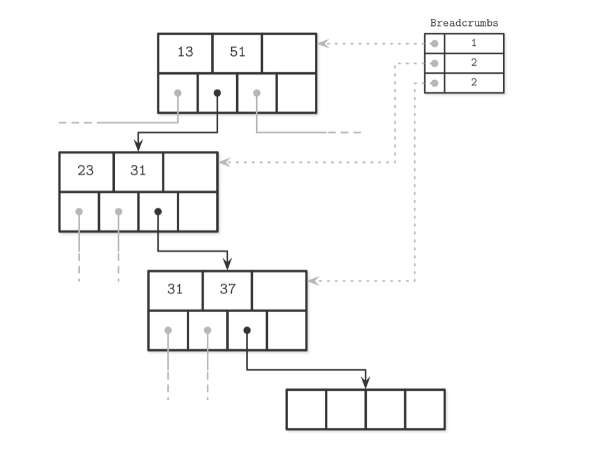  
> 比如我们要插入一个大于37的数值， 查找路径入上入所示， Breadcrumbs记录了每个insertion point的offset。 Breadcumbs的实现一般是stack

### Rebalancing
通常来讲， 树的再平衡会涉及到大量的split和merge， 进而影响数据库性能。所以数据库通常会延迟split和merge， 并使用一种相对开销较少的方式去实现reblancing -- 平衡邻居节点之间的数据， 把有较多数据的节点的数据搬到隔壁的节点， 从而避免节点之间的split和merge

### Right-only appends
很多场景下 ， 数据库都有一个自增的键比如一个自增的id， 如果还是采用常规的自上而下的查找方式是纯粹的浪费时间。
Postgresql等数据库， 会直接比较插入的key的值和最右页（存储最大数据的page）的第一个key进行比较， 如果查要插入的key的值更大且该页仍有足够空间， 那么就直接把数据插入到这个最右页上， 避免了自上而下的查找（计算复杂度变化： LogN -> 常数时间，改进很大），这种方式也叫fast path

### 压缩
数据的压缩会牵涉到一个很重要的指标： 压缩率:

- 更高的压缩率意味着更好的空间利用率
- 同时意味着， 更高的时间复杂度， 因为解压缩会消耗大量的cpu资源

很明显， 这里有一个非常重要的tradeoff : 空间vs时间

另外通常来讲， 我们不会再文件层级去压缩数据， 只会在page级别， 很明显前者会影响查询效率。

另外压缩的方式除了和page绑定在一起， 也可以作为一种插件的形式进行， 和page的管理进行解耦（比如对整个column的数据进行压缩， 其实列式数据就是这么做的）

## 第五章 Transaction Processing and Recovery
### Buffer managment
类似于IO系统， 数据库也会使用类似缓存页(page cache)的概念来管理访问数据的缓存。

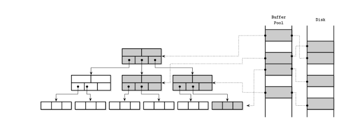  
上图展示了B+树的节点Page在缓存池以及在磁盘上的对应关系。
Page cache机制的包括：

- 将数据保留在内存
- 如果要的Page在内存中， 直接返回缓存页
- 如果需要的Page不再内存中， 且Buffer pool足够大， 会将该页存储在缓存池（page in）
- 如果没有足够空间来存储新的缓存页， 就需要运行某种机制淘汰（eviction）一部分缓存页（比如使用LFU, LRU， CLOCK等算法）， 然后当缓存页被淘汰的时候， 会写道磁盘以保证数据的一致性

缓存页可以看作是数据请求和磁盘之间的中间层， 除了数据的读取， 数据的变更其实也是优先发生在这个中间层， 而不是直接写入到磁盘， 在内存中的缓存页数据被修改的时候， 这个时候这个页面就会被标识脏页(dirty page),  标识和磁盘数据不同步。
当然dirty page中的数据最后一定会被写入到磁盘， 为了保证这个过程不会出现纰漏（比如由于停电等原因， 改变的数据没有被同步到磁盘， 进而影响了数据库的ACID保证）， 通常会使用一种叫做WAL（write ahead log, 预写日志）的机制来保证数据的一致性
> WAL其实就是一系列的数据变更记录， 通常会在事务成功发生之后（commit）被保存在磁盘， 由于很多条记录其实可以被合并成一条， 比如对一个账户A增加1000， 记录一次， 减少1000再记录一次， 那这两条记录就可以被抵消掉， 另外WAL虽然是基于磁盘的， 但是它是顺序写入而不是随机写入 ，所以它的写入速度也是很快的

### 缓存页淘汰机制
常见的有LRU（Least Recently Used）, LFU(Least Freaquntly Used)，CLOCK。 LRU会比较侧重一个时效性， 越是被最近访问的Page原容易被缓存（最新访问的page会被放到链表的尾部， 然后链表头部的数据会被淘汰掉）， 在实践中(不只是数据库领域)， LFU通常会更常用一点， LFU相较于LRU会更侧重Page的访问频率， 低频的页会被有限淘汰

Clock机制

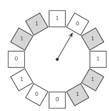  
clcok机制就是用一种环形链表将所有的Page组织在一起， 当页面被访问， 它就会被设置为1（上图灰色所示）， 当后台运行淘汰任务的时候， '指针'随机指向一个Page, 如果它是0（最近没有被访问）就会被淘汰掉， 也就是说它和LRU相比， 增加了一个随机性
如果对clock机制进行一定的改造， 把1和0的bit标识改成数值(被引用次数)， 然后当一个缓存页码，每次访问的时候， 它对应的数值就会+1， 淘汰指针转动的时候则-1, 如果是0就该页就会被淘汰， 那么它就被改造成了类似LFU的模式

### 数据库日志
我们在前面的Buffer management的时候提到过淘汰缓存页时，就需要将数据写入磁盘， 为了保证数据的一致性， 需要用到WAL。WAL本质上是一种日志， 在某些数据库还会按照功能区分为： redo日志， undo日志， 简单来讲redo是为了数据恢复的， undo是为了将已经保存到了数据库的数据撤回的。
然后日志的类型会有两种， 一种是物理日志(pysical log)， 日志文件将会将数据直接记录在日志中； 另一种是逻辑日志(logical log)， 逻辑日志只记录了操作而没有数据。因为物理日志有数据， 所以通常会被用在redo阶段， 这样数据恢复会更快， 逻辑日志则会被用在undo阶段
这里我们说之所以会需要undo数据（写入了磁盘的数据并没有完成commit），  写入磁盘的操作允许被发生在commit之后， 这种数据库策略通常被称为no-force/steal 策略，相对的force/no-steal则会要求数据在commit之前写入数据， 所以force策略下， 数据库在恢复的时候只要关心redo日志就好， 因为根据策略， 但凡是日志中显示commit是先需要写入磁盘的。
但是为啥数据库还会允许no-force的这种发生写盘操作在commit之后的操作存在呢， 原因也很简单， 提升tansaction的速度。
最后， 关于数据库日志还有一个概念是checkpoint， 顾名思义就是日志的记录点， 每个checkpoint都有一个对应的LSN（log sequence number, 单调增）， 目的是为了替身redo和undo效率的， 有了checkpont我自要从上一个LSN进行数据恢复操作就好了， 而不需要每次把所有脏页进行写盘
### 并发控制
数据库中由于并发引起的读写异常， 其实和隔离级别（isolation level）有关， 常见的隔离级别有(从低到高)：

- Read Uncomiited,  允许事务并发读取别的没有提交的事务， 这种隔离级别下， 很容易导致脏读
- Read Commited, 一个事务只能去读已经被提交了记录。但是这种隔离级别依然无法保证对相同数据同时读取（已经都是提交了的）， 能观察到相同的数据； 因为有可能在数据读取的过程中， 数据发生了改变， 导致并非读看到不一样结果
- Reapetable Read，所以在上一个隔离级别的基础上， 这个级别能保证 对数据的同时访问， 获取相同的结果
- Serializable， 最强的隔离级别， 意味着所有的事务都是按照时序展开， 会有最强的数据一致性保证，也就意味着最糟糕的并发性能

下图展示了各种隔离级别对应的读写异常的可能性， 可以看到Seriaizable基本是绝缘所有并发引起的读写异常， 当然代价就是牺牲并发. 

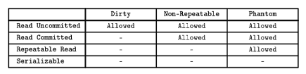  

### 3种并发控制流派
有三种常见的并发控制流派：

- OCC， Optimistic concurrency control
- MVCC,  Multiversion concurency control
- PCC, Pessimistic concurency control

#### OCC
把事务分成三个阶段：

- Read phase
- Validation phase
- Write phase

在第一阶段， 会把所有并发的事务的dependency写入到read set（不改变数据库状态的操作）和write set中（会有副作用， 会改变数据库操作）
第二阶段， 就是根据read set和write set中的操作， 特别是有相交（冲突）部分的操作， 对那些可能会受影响的事务， 比如一个读相关的事务， 它的数据正在被另一个事务写， 那么这个读的事务就会被终止， 不然会导致脏读
第三阶段， 当然， 如果在第二阶段中没有检查到冲突，就可以顺利的提交

#### MVCC
简单来讲就是给所有的事务一个单调增的事务ID， MVCC通常不会阻止你去取旧的数据， 但是通常会确保在系统里面只存在一个没有提交的事务版本（version）
> 所以这种方式应该会产生脏读， 但是因为只允许耽搁未提交事务版本， 所以最终一致性还是可以保证的

#### PCC
PCC通常会和锁一起出现， 当然也有不需要要锁的实现方式， 其中最简单的PCC实现方式就是基于时间戳， 通常会有两个时间戳：

- max_read_timestamp
- max_write_timestamp

除了写操作被允许可以在max_write_timestamp之前被执行， 其他的操作不能在另一个读写操作的最大timestamp执行
相对而言， 基于锁的实现方式会更加流行

### 锁
#### 死锁Deadlock
死锁会发生在两个进程或者说事务都在等待彼此去释放锁， 有点类似于循环引用的问题(A模块要导入b， b模块也要导入A)

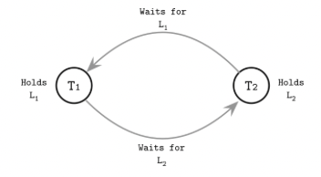
怎么去解决死锁呢， 当然一种简单的方式就是给登台加上一个timeout时间， 这样就可以避免陷入无限等待。
还有方式就是让系统去识别这种可能造成死锁的状态， 也就是一个后台程序去检查事务直接存在不存在上面的waits-for graph， 如果存在就停掉其中的一个事务。

#### Latches
Latch也是锁， 但是和lock不一样的点在于， lock更多的是一种更高高级的抽象概念，远离数据库内核的存储结构。 而latch， 则是更接近数据存储结构的， 它是用来解决Page层面也就是更底层的竞争问题的。
我们可你是不希望一个Page在被更高或者说要被split和merge的时候被访问， 因为这样很可能会导致我们前面提到的读异常， 所以需要Latch在更底层帮我们去控制竞争。
但是由于B树的特殊性， 我们知道子节点的merge和split很有可能会向上传播到root（当然只是可能， 并不是绝对）， 那么仅仅在某个页面上进行竞争控制是不够的。一种相对朴素的实现方法， 就是对整个访问路径上的所有Page加上Latch, 淡然这种肯定胡牺牲性能。
所以更常用的方式， 是使用Latch crabbing的一种方式：这种方式它不会一直保留整个访问路径上的page上的锁， 而是从根节点开始， 不断向下， 只要当前节点不是full的状态(意味着大概率不会被至下而上的split merge影响） 我们就打开这个锁， 所以在特点的时间节点， Latch crabing只会给很小一部分page加锁
 
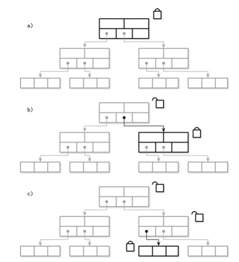  

## 第六章 B-Tree Variants
如何提升基于B-Tree存储结构的数据库读写效率呢， 主要的改进方向其实就是->减少访问硬盘的次数和时间（特别是减少小批量的写入）, 再这种所提到的所有改进方法都是围绕这个核心点来的

### Copy-on-write B-Tree
传统的B-树， 一般底层使用latch来解决再并发时的问题， copy-on-write直接舍弃了这种方式，直接复制会被修改的page(也就是脏页)，同时不会阻止用户访问旧数据。
当新的Page结构被构建完成的时候， 更新原有B-Tree的指针， 指向新的Page即可:

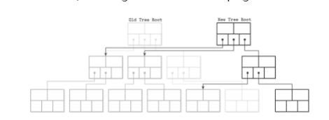  
这种方式无疑是增加了磁盘空间的消耗， 好处有:

- 避免了latch的使用
- 读写互不影响
- 数据库系统也不会处在一种被污染的状态(无非就是新的页的pointer没有替换掉老的， 但是原来的树结构和数据还是完整的， 只是过时了而已)
### Lazy  B-Trees
lazy B-Tree主要时通过结合内存或者说优化page cache的方式， 减少磁盘访问。以mongodb种使用的默认存储引擎WiredTiger为例（简称WT）
WT首先会保留一份磁盘种的树结构， 当然只是Index， 并没有具体的数据。当某个page首次被读取的时候，这个page的内容会复制到到对应的update buffers， 用户可以被允许直接访问update buffers中的数据（还没被写入磁盘）， 后天程序会周期性地将update buffer数据写入到磁盘取覆盖原来的Page， 如果覆盖页的size大于原来的size， 它会拆分成多个页
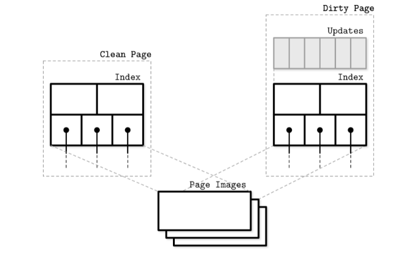  

### FD-Tree
FD-Tree结合了B+tree和LSM树的特征（核心特点就是从随机磁盘写入->顺序写入）。
它在最顶层（也称为L0）会维护一颗树， L0在无法存储更多key的时候， 会把key融合到下一层（不是所有key， 而是特殊的key， 也被称为fence, 这些fence会有一个指向下一层的Pointer
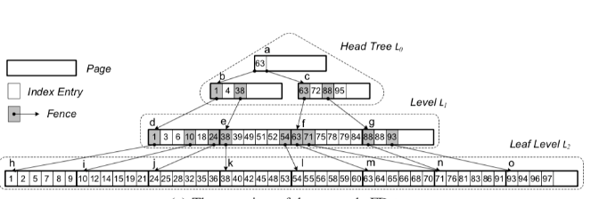  
上图是FD-Tree的一个样例，可以看到最的顶层（L0）是一个树结构， 然后灰色的方框就是特殊的Index entry， 指向下一level的array的相同entry, 但是fence也有开那个中类型， 一种是external， 这种类型会被merge到下一层（也就是下一层会有一个相同的entry）， 另外一种是internal（比如上面的88）， 你会发现它只出现在L1没有出现在L2.
FD-Tree的查找复杂度也是Log数量级

## 第七章
前面一章， 对数据库优化方向主要围绕减少磁盘写入开销的来的， 以WiredTiger为例的方法， 都是通过数据的缓存管理来实现上面这目标， 还有一种优化的方向， 就是把耗时的磁盘随机写入操作转化为磁盘的顺序写入， LSM-Tree就是这种思想的集大成者。
LSM-Tree， 全称log structed merge， 这个名字本身就昭示了这种存储结构的特征：

- log structure： 像日志一样只会在磁盘中追加写入(append only)
- merge， 不在磁盘中删改数据， 通过merge来应对不同版本数据的问题

LSM树由于append only的特征， 所以这种结构是非常适合写多于读的场景（吞吐量ingestion较高的场景）， 另外由于读写在结构上互不影响， 所以不会受类似B-tree的锁机制影响并发性能

### LSM的构成

- Memtable(下面两个都算是memetable, 前者接受写， 后者只接受读）， 在内存中
- Current memtable
- Fushing memtable
- On-disk flush target
- Flush tables
- Compacting tables
- Compated tabe

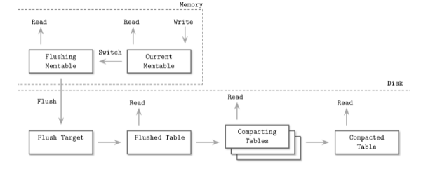  
上图显示了LSM的整个生命周期，其中除了Current Memtable同时支持读写以外， 其他的阶段只支持读数据， 不支持数据的写入
另外有两个要点：

- 数据在内存中的时候， 它是排过序的
- 数据在被写入磁盘的时候， 也会用的WAL， 防止数据丢失
- 当数据被写入磁盘之后， 内存中的数据就会消失， 那么后续相关数据的查询之恶能通过磁盘中的数据获取

### LSM中的更新和删除
更新的话很简单， 只要写入新的数据就好， 新的数据会在后买你覆盖旧数据，问题在于如何删除数据。由于我们不会直接删除LSM存储在磁盘的数据， 如果一个数据同时存储在Memtable和Disk table的情况下， 我如何在不直接删除Disk table的数据来实现删除呢。 常用的方法就是为这个需要被删除的key设置一个tomestone（墓碑）， 这样在merge的时候，老的数据会被tomestone覆盖掉， 就达到了删除的效果

### LSM中的merge操作
因为数据会被存储在多个磁盘区域， 很有可能多个disk table这间会有数据冲突的问题， 即它们都保有相同key的数据， 所以需要通过merge来解决冲突
整个流程划分为一下三个步骤：

- 从不同的迭代器(就是存储在不同区域的磁盘数据， 他们本身是sorted的， 所以可以支持iteration)依次获取数据
- 把这些候选值入队（优先队列，可以通过min heap小顶堆来实现)， 最小的那个值放入结果集
- 继续从被选择的迭代器中补充数据加入队列

重复上面的流程， 如果第二个流程遇到key相同的情况， 可以选择通过记录本身携带的timestampe来解决冲突

### LSM中的压缩(compact)
常用的方法有Leveled compaction和Size-tiered
这里以Leveled 为例， 位于顶层(接近0)的table会将数据不断“下沉”
到下一个level（前提是当前的level放不下更多table了）， 这个过程会对key的范围重合的table进行融合

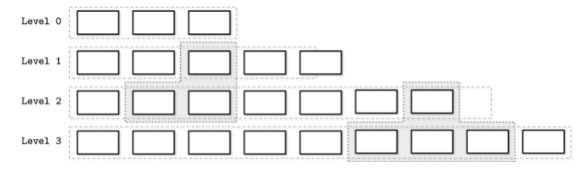  
比如level 1 和 Level 2中的阴影部分， 它们key range 重合了， 所以需要融合。 融合的结果就是， 上面的数据， 也就是新的数据在观感上会一点点地“下沉”到下一个level。
另外， 通常来说下一层的Level会保留上一层2倍左右的大小

### LSM的读/写/空间放大
我们优化数据的目标其实就是解决写放大， 读放大以及空间放大的问题：

- 读放大：需要读取多个地址来获取数据, LSM会有这个问题
- 写放大： 需要大量的重写操作， B树有这个问题， 在涉及到page层面的数据增删的时候， LSM的compact阶段其实也有
- 空间放大： LSM会有冗余数据， 所以这个很明显是有的

有一种指标RUM conjection（RUM分别代表read，update以及memeory）可以被用来比较及衡量一个数据库引擎的综合性能。我们需要了解的是， 通常来说， 解决上面中的任一一个问题， 都需要付出其他两个点中的1个或2个作为代价， 有点类似于分布式理论中的CAP理论， 你们很难同时拥有所有好处

### LSM 实现细节
#### SSTable(sorted string table)
LSM树中的table是基于SSTable实现的  

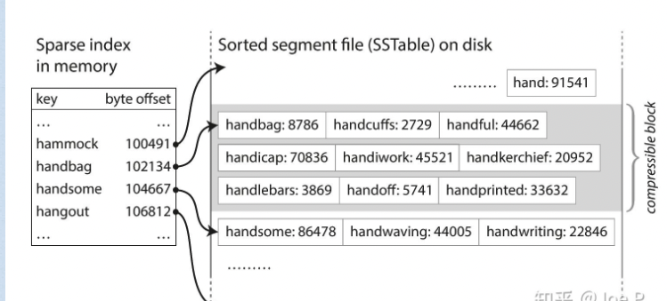  
SST也会用到hash表， 但是是一个稀疏的hash表， 只记录了部分key和它们的位置（offset）， 数据本身是以key和value连续存储在磁盘上的
#### Bloom filter
LSM存在的一个性能瓶颈就是读放大， 就是它的数据存储在多个table， 如果存在一个key， 在所有的数据文件中并不存在， 它依然需要取读所有的文件， 从而成为性能瓶颈， 所以可以使用Bloom filter来过滤掉不存在的key， 今儿减少读放大引起的性能问题

#### Skiplist
将文件顺序地存储在内存的一种方式就是使用skiplist
 

### Unordered LSM Storage
一一般来说lsm的数据都是以有序地形式被存储的， 当然也有并不是有序形式存储的结构
#### Bitcask
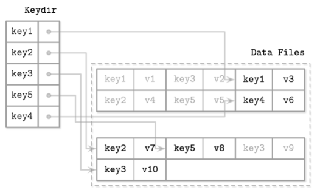  

bitcask会在内存中保留一份key的最新路径的hash表(Keydir), keydir会在数据库初始话的时候被加载到内存， 所以很自然地会导致初始化时间过长的问题， 同时由于数据是直接被追加到磁盘的， 并不是有序（也没有什么memtable）， 所以bitcask也不支持范围查询（range query)。
但是它的优势也很明显， 首先点查询非常快， 同时写入数据是直接追加的所以写入性能也很好

#### Wisckey
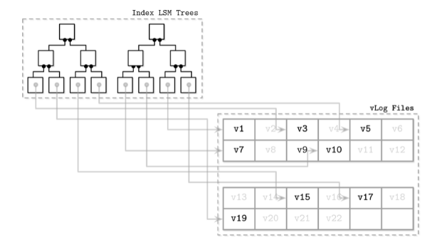  

wisckey会将index和数据记录分开记录（SST， key和value是存储在一起的）， 分别存储在index lsm tree和vlog files。
vlogs files类似bitcask， 是无序地， 顺序增加的日志文件index lsm tree保留了指向vLog的指针， 所以它可以保留了范围查询的优点
它的缺点是， 有序vlog没有关于数据的l生命周期的信息(liveness, 也就是数据是不是仍然是有效的)， 所以在垃圾回收的时候， 必须要遍历左侧的index tree， 增加了复杂度。 传统的lsm， 哪怕是被删除的数据， 也可以在数据压缩阶段被直接覆盖(前面提到的类似墓碑的标记)

