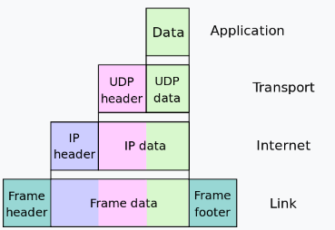

# 网络编程入门
同时也算是[beej‘s guide to network programming](https://beej.us/guide/bgnet/html/split/index.html)的阅读笔记， 
当然这里不一定会按章原书的章节原封不动的来， 会穿插一些个人见解（囿于水平有限， 无法保证都是对的）

## 前置知识

### 什么是socket
在unix系统中， 所有的一切都是文件，这些文件会关联一个文件描述符（其实就是一个整数， 可以理解为这些文件的id）。  
当我们在unix系统中， 使用scoket()会返回一个文件描述符（文件id）, 然后我们通过send和recv对这个文件上进行了类似write和read的操作， 
以此来达到交换数据的目的

### socket类型
网络socket是有两种类型的：  
- stream
- dgram(DATAGRAM)  

前者使用的是TCP协议(Transmission Control Protocol), TCP协议在传输过程中是要一直保证链接的， 而且数据包是有序传递的(使用telnet就是顺序传输信息的)且会是完整传递；  
相反地datagram使用的是UDP（User Datagram Protocol）， 数据不能保证是有序的， 甚至不能保证数据是完整的（当然相应的， udp的传输可以更快）。

>  有些文件传输软件， 比如tftp其实用的也是udp， 但是它在udp协议的基础上又添加了一层协议，这层协议会要求接收者受到信息后返回一个信号ACK,信息发送者只有收到这个信号才能表示发送信息成功， 不然信息会被重发

### Data Encapsulation
我们知道OSI（open system interconnect ）会有7个层级： 
- Application
- Presentation
- Session
- Transport
- Network
- Data Link
- Physical

每一个层级都会携带一些相应的信息，最开始用户发送的出去的信息可能就是一个简单的字符串， 这一串信息会被层层封包：  



越外层的封包信息， 越接近物理层， 为什么？因为数据的接收者， 肯定先是物理层， 比如Ethernet， wifi这些靠近物理的layer， 最后层层解包， 拿到被封装在最里面的数据data


### ipv4和ipv6
ipv4地址， 诸如： 192.10.2.111, 就是4字节， 32位的地址，也就是存着2的32次方的可能性， 大概最多能表示40亿个地址。  
在互联网刚刚诞生的时候， 40亿当然是个天文数字， 但是在人均都有手机以及各种可以联网的穿戴设备的今天， 40亿有点捉襟见肘了。  
ipv6则是16个字节， 也就是128位， 意味着能表示2的128种地址， 所以很显然， 即便是全宇宙的生物体都有一台能连接互联网的手机， 应该也是够够用了。  
ipv6的地址：  2001:0db8:c9d2:aee5:73e3:934a:a5ae:9551  
上面每个冒号分割的都是用16进制表示的2个字节， 也就是16位(16 * 8刚好就是128)
在ipv6在表示上， 为了更简便， 可以压缩每个冒号分割中靠前面的0， 比如上面的0db8这部分可以压缩成db8。  
类似0000:0000:0000:0000:0000:0000:0000:0001这样的地址可以直接被压缩位::1,这个就是相当于ipv4中locahost， 即127.0.0.1 。
另外ipv4是可以转化位ipv6， 转化规则并没有我们想象中的需要牵涉到进制的转化，而是直接在ipv4地址的基础上加上前缀， 比如地址192.0.2.33可以转化位 ::ffff:192.0.2.33
### subnets子网
通常我们会把ip地址拆分成所谓network部分和host部分，假设我们的netmask是255.255.255.0
，然后我们的ip地址是192.0.2.33， 那么这个地址的network部分就是192.0.2.0， 这个值就是子掩码和ip地址执行逻辑与的结果。   
一种更为灵活的表示方法是将ip地址直接表示为192.0.2.33/24 （也就是netmask是255.255.255.0）， ipv6也是同理
### 字节顺序
字节序有两种， 一种是大端（Big-Endian）另外一种是小端（Little-Endian），大端字节序通常会把最有效位存储在较低的地址， 小端则相反。  
比如大端会把一个10进制数字100中的1， 先存储在内存的较低的位置。  
由于网络基本上是大端存储的， 而很多操作系统又是小端的， 所以在信息传输的过程中自然会涉及到字节序的转换。  
比如函数htons()， 这个函数就是用来把host的short格式的数据转化成network的short格式


## 应用1-查找ip地址
### 代码
```c
/*
** showip.c -- show IP addresses for a host given on the command line
*/

#include <stdio.h>
#include <string.h>
#include <sys/types.h>
#include <sys/socket.h>
#include <netdb.h>
#include <arpa/inet.h>
#include <netinet/in.h>

int main(int argc, char *argv[])
{
    struct addrinfo hints, *res, *p;                  // 1 
    int status;
    char ipstr[INET6_ADDRSTRLEN];

    if (argc != 2) {
        fprintf(stderr,"usage: showip hostname\n");
        return 1;
    }

    memset(&hints, 0, sizeof hints);
    hints.ai_family = AF_UNSPEC;                      // 2
    hints.ai_socktype = SOCK_STREAM;

    if ((status = getaddrinfo(argv[1], NULL, &hints, &res)) != 0) {   // 3 
        fprintf(stderr, "getaddrinfo: %s\n", gai_strerror(status));
        return 2;
    }

    printf("IP addresses for %s:\n\n", argv[1]);

    for(p = res;p != NULL; p = p->ai_next) {   // 4 
        void *addr;
        char *ipver;

        // get the pointer to the address itself,
        // different fields in IPv4 and IPv6:
        if (p->ai_family == AF_INET) { // IPv4
            struct sockaddr_in *ipv4 = (struct sockaddr_in *)p->ai_addr;
            addr = &(ipv4->sin_addr);
            ipver = "IPv4";
        } else { // IPv6
            struct sockaddr_in6 *ipv6 = (struct sockaddr_in6 *)p->ai_addr;
            addr = &(ipv6->sin6_addr);
            ipver = "IPv6";
        }

        // convert the IP to a string and print it:
        inet_ntop(p->ai_family, addr, ipstr, sizeof ipstr);
        printf("  %s: %s\n", ipver, ipstr);
    }

    freeaddrinfo(res); // free the linked list

    return 0;
}
```

### 说明
> 说明的数值标识对应代码后面的数字注释

1. addrinfo是一个特殊的结构体， 结构体的签名如下：
```c
struct addrinfo {
    int              ai_flags;     // AI_PASSIVE, AI_CANONNAME, etc.
    int              ai_family;    // AF_INET, AF_INET6, AF_UNSPEC
    int              ai_socktype;  // SOCK_STREAM, SOCK_DGRAM
    int              ai_protocol;  // use 0 for "any"
    size_t           ai_addrlen;   // size of ai_addr in bytes
    struct sockaddr *ai_addr;      // struct sockaddr_in or _in6
    char            *ai_canonname; // full canonical hostname

    struct addrinfo *ai_next;      // linked list, next node
};
```
可以看到addrinfo除了会包含一些和网络地址， socket 类型等基础信息之外， 还有一个指向下一个地址的指针（ai_next）， ai_addr是一个指向sockaddr结构体的指针：
```c
struct sockaddr {
    unsigned short    sa_family;    // address family, AF_xxx
    char              sa_data[14];  // 14 bytes of protocol address
}; 
```
sa_data当然存储的是协议地址， 在实际代码编写的时候我们会使用sockaddr_in(ip4地址)或者sockaddr_in6(ipv6)， 然后转化为sockaddr， 这里一sockaddr_in为例， 它的结构是：
```c
struct sockaddr_in {
    short int          sin_family;  // Address family, AF_INET
    unsigned short int sin_port;    // Port number
    struct in_addr     sin_addr;    // Internet address
    unsigned char      sin_zero[8]; // Same size as struct sockaddr
};
```
上面的sin_family就是个枚举值，和addrinfo的ai_family的值其实是一致的。
然后是上面的in_addr：
```c
struct in_addr {
    uint32_t s_addr; // that's a 32-bit int (4 bytes)
};
```
然后in_addr就是个4字节的地址信息（ipv4地址）

2. 这里我们没有限定是IPV4还是IPV6, 如果想要限定， 可以通过AF_INET， AF_INET6来限定IPV4或IPV6
3. getaddrinfo会返回一个整数值， 如果该值为0， 标识运行成功， 不然就是有错误
> 这里插一句： go语言的错误处理机制从某种意义上来讲， 沿袭了c语言， 也就是直接返回错误， 让调用者决定如何处理， 而不是抛出异常的这种java/python的方式

4. 这里我们进入了一个for循环， 前面我们有提及addrinfo本质上是一个链表，它有一个指向下一个addrinfo的指针， 我们不断循环获取addr地址， 然后用这个地址去获取ip地址的字符串（inet_ntop中的ntop实际为 network to presentation）


## 应用2-使用scoket进行网络传输
使用socket进行通行， 通常会牵涉到两个角色：
 - 接受信号的， 我们称之为server服务端
 - 发送信号的， 我们称之为client客户端
server既然是接受信号的， 涉及的流程通常会有listen（监听）和recv（接受数据， 如果是udp的话就是recvto）
client主要是发送信号的， 所以他通常会涉及connect（链接）和send（传送， 如果是udp的话就是sendto）
上面所有的操作首先是需要围绕调用socket函数返回的套接字描述符(socket descriptor)展开的

### 代码
```c
#include <string.h>
#include <sys/types.h>
#include <sys/socket.h>
#include <netdb.h>

#define MYPORT "3490"  // the port users will be connecting to
#define BACKLOG 10     // how many pending connections queue will hold

int main(void)
{
    struct sockaddr_storage their_addr;    
    socklen_t addr_size;
    struct addrinfo hints, *res;
    int sockfd, new_fd;

    // !! don't forget your error checking for these calls !!

    // first, load up address structs with getaddrinfo():

    memset(&hints, 0, sizeof hints);
    hints.ai_family = AF_UNSPEC;  // use IPv4 or IPv6, whichever
    hints.ai_socktype = SOCK_STREAM;
    hints.ai_flags = AI_PASSIVE;     //  1 

    getaddrinfo(NULL, MYPORT, &hints, &res);   

    // make a socket, bind it, and listen on it:

    sockfd = socket(res->ai_family, res->ai_socktype, res->ai_protocol); // 2
    bind(sockfd, res->ai_addr, res->ai_addrlen);     // 3
    listen(sockfd, BACKLOG);                         // 4

    // now accept an incoming connection:

    addr_size = sizeof their_addr; 、、 5
    new_fd = accept(sockfd, (struct sockaddr *)&their_addr, &addr_size); //5 

    // ready to communicate on socket descriptor new_fd!
        .
        .
        .
```
### 说明
1. 使用AI_PASSIVE作为我们ai_flags就是告诉程序我要绑定本机的ip， 这也就是是为什getaddrinfo的第一个参数可以是空的， 因为我是server，所以不需要特定的server name，
2. 这里调用了socket函数， 返回一个套接字描述符， socket的三个参数， ai_family就是前面提到的ipv4或者ipv6， sockettype是前面提到的SOCKETSTREAM（tcp协议）或者SOCKETDGRAM（udp协议）
3. bind使用了socket返回的描述符号， 然后会bind到一个具体的port
4. 然后server调用liste开启监听， BACKLOG是一个常量用来控制能同事监听的最大数量(其实就是限制了监听队列的大小)
5. accept其实就是把客户端的connect给accept的意思，然后accept会返回一个全新的套接字描述符号， 这个新的描述符就是后续用来send 

## 应用3 - 简单的server & client实现
完整代码的话， 直接参考：https://beej.us/guide/bgnet/html/split/client-server-background.html

### server端
整体的server的运行流程还是遵循了前面提到的几个关键点：  
 -  geraddtrinfo获取ip地址信息
 - socket 建立一个套接字链接返回socket descriptor
 - bind  绑定特定port
 - listen 监听
 - accept 接受一个incomming connection
 - send 通过socket发送信息

不过这里为了同时处理更多的链接， 会用fork开启一个子进程：  
```c
    while(1) {  // main accept() loop
        sin_size = sizeof their_addr;
        new_fd = accept(sockfd, (struct sockaddr *)&their_addr, &sin_size);
        if (new_fd == -1) {
            perror("accept");
            continue;
        }

        inet_ntop(their_addr.ss_family,
            get_in_addr((struct sockaddr *)&their_addr),
            s, sizeof s);
        printf("server: got connection from %s\n", s);

        if (!fork()) { // this is the child process
            close(sockfd); // child doesn't need the listener
            if (send(new_fd, "Hello, world!", 13, 0) == -1)
                perror("send");
            close(new_fd);
            exit(0);
        }
        close(new_fd);  // parent doesn't need this
    }
```

> fork在成功开启子进程的时候， 返回值是0， 所以 !0 就是true; 但是这里没有fork失败的处理逻辑

因为用到了子进程， 自然需要有子进程的垃圾回收
```c
    sa.sa_handler = sigchld_handler; // reap all dead processes
    sigemptyset(&sa.sa_mask);
    sa.sa_flags = SA_RESTART;
    if (sigaction(SIGCHLD, &sa, NULL) == -1) {
        perror("sigaction");
        exit(1);
    }
```

当主进程通过`sigaction`获取到了SIGCHLD这个信号的时候， 会触发函数sigchld_handler来进行GC：

```c
void sigchld_handler(int s)
{
    // waitpid() might overwrite errno, so we save and restore it:
    int saved_errno = errno;

    while(waitpid(-1, NULL, WNOHANG) > 0);

    errno = saved_errno;
}
```

### client端
client的代码会比较简单， 它的流程和server有少许不一样： 
- getaddrinfo， 不过作为client，我的第一个参数是需要指定server name的
- socket
- connect
- recv， 和服务端需要使用accept返回的新的socket descriptor来发送信息， client直接用socket返回的desciptor就可以接受信息了
That's it
