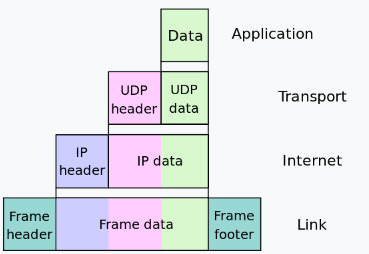

# 网络编程入门
同时也算是[beej‘s guide to network programming](https://beej.us/guide/bgnet/html/split/index.html)， 
当然这里不一定会按章原书的章节原封不动的来， 会穿插一些个人见解（囿于水平有限， 无法保证都是对的）

## 前置知识

### 什么是socket
在unix系统中， 所有的一切都是文件，这些文件会关联一个文件描述符（其实就是一个整数， 可以理解为这些文件的id）。  
当我们在unix系统中， 使用scoket()会返回一个文件描述符（文件id）, 然后我们通过send和recv对这个文件上进行了类似write和read的操作， 
以此来达到交换数据的目的

### socket类型
网络socket是有两种类型的：  
- stream
- dgram(DATAGRAM)
前者使用的是TCP协议(Transmission Control Protocol), TCP协议在传输过程中是要一直保证链接的， 而且数据包是有序传递的(使用telnet就是顺序传输信息的)且会是完整传递；  
相反地datagram使用的是UDP（User Datagram Protocol）， 数据不能保证是有序的， 甚至不能保证数据是完整的（当然相应的， udp的传输可以更快）。

>  有些文件传输软件， 比如tftp其实用的也是udp， 但是它在udp协议的基础上又添加了一层协议，这层协议会要求接收者受到信息后返回一个信号ACK,信息发送者只有收到这个信号才能表示发送信息成功， 不然信息会被重发

### Data Encapsulation
我们知道OSI（open system interconnect ）会有7个层级： 
- Application
- Presentation
- Session
- Transport
- Network
- Data Link
- Physical

每一个层级都会携带一些相应的信息，最开始用户发送的出去的信息可能就是一个简单的字符串， 这一串信息会被层层封包：  



越外层的封包信息， 越接近物理层， 为什么？因为数据的接收者， 肯定先是物理层， 比如Ethernet， wifi这些靠近物理的layer， 最后层层解包， 拿到被封装在最里面的数据data


### ipv4和ipv6
### subnets子网
### 字节顺序


## 应用1-查找ip地址
### 代码
```c
/*
** showip.c -- show IP addresses for a host given on the command line
*/

#include <stdio.h>
#include <string.h>
#include <sys/types.h>
#include <sys/socket.h>
#include <netdb.h>
#include <arpa/inet.h>
#include <netinet/in.h>

int main(int argc, char *argv[])
{
    struct addrinfo hints, *res, *p;                  // 1 
    int status;
    char ipstr[INET6_ADDRSTRLEN];

    if (argc != 2) {
        fprintf(stderr,"usage: showip hostname\n");
        return 1;
    }

    memset(&hints, 0, sizeof hints);
    hints.ai_family = AF_UNSPEC;                      // 2
    hints.ai_socktype = SOCK_STREAM;

    if ((status = getaddrinfo(argv[1], NULL, &hints, &res)) != 0) {   // 3 
        fprintf(stderr, "getaddrinfo: %s\n", gai_strerror(status));
        return 2;
    }

    printf("IP addresses for %s:\n\n", argv[1]);

    for(p = res;p != NULL; p = p->ai_next) {   // 4 
        void *addr;
        char *ipver;

        // get the pointer to the address itself,
        // different fields in IPv4 and IPv6:
        if (p->ai_family == AF_INET) { // IPv4
            struct sockaddr_in *ipv4 = (struct sockaddr_in *)p->ai_addr;
            addr = &(ipv4->sin_addr);
            ipver = "IPv4";
        } else { // IPv6
            struct sockaddr_in6 *ipv6 = (struct sockaddr_in6 *)p->ai_addr;
            addr = &(ipv6->sin6_addr);
            ipver = "IPv6";
        }

        // convert the IP to a string and print it:
        inet_ntop(p->ai_family, addr, ipstr, sizeof ipstr);
        printf("  %s: %s\n", ipver, ipstr);
    }

    freeaddrinfo(res); // free the linked list

    return 0;
}
```

### 说明
> 说明的数值标识对应代码后面的数字注释

1. addrinfo是一个特殊的结构体， 结构体的签名如下：
```c
struct addrinfo {
    int              ai_flags;     // AI_PASSIVE, AI_CANONNAME, etc.
    int              ai_family;    // AF_INET, AF_INET6, AF_UNSPEC
    int              ai_socktype;  // SOCK_STREAM, SOCK_DGRAM
    int              ai_protocol;  // use 0 for "any"
    size_t           ai_addrlen;   // size of ai_addr in bytes
    struct sockaddr *ai_addr;      // struct sockaddr_in or _in6
    char            *ai_canonname; // full canonical hostname

    struct addrinfo *ai_next;      // linked list, next node
};
```
可以看到addrinfo除了会包含一些和网络地址， socket 类型等基础信息之外， 还有一个指向下一个地址的指针（ai_next）， ai_addr是一个指向sockaddr结构体的指针：
```c
struct sockaddr {
    unsigned short    sa_family;    // address family, AF_xxx
    char              sa_data[14];  // 14 bytes of protocol address
}; 
```
sa_data当然存储的是协议地址， 在实际代码编写的时候我们会使用sockaddr_in(ip4地址)或者sockaddr_in6(ipv6)， 然后转化为sockaddr， 这里一sockaddr_in为例， 它的结构是：
```c
struct sockaddr_in {
    short int          sin_family;  // Address family, AF_INET
    unsigned short int sin_port;    // Port number
    struct in_addr     sin_addr;    // Internet address
    unsigned char      sin_zero[8]; // Same size as struct sockaddr
};
```
上面的sin_family就是个枚举值，和addrinfo的ai_family的值其实是一致的。
然后是上面的in_addr：
```c
struct in_addr {
    uint32_t s_addr; // that's a 32-bit int (4 bytes)
};
```
然后in_addr就是个4字节的地址信息（ipv4地址）

2. 这里我们没有限定是IPV4还是IPV6, 如果想要限定， 可以通过AF_INET， AF_INET6来限定IPV4或IPV6
3. getaddrinfo会返回一个整数值， 如果该值为0， 标识运行成功， 不然就是有错误
> 这里插一句： go语言的错误处理机制从某种意义上来讲， 沿袭了c语言， 也就是直接返回错误， 让调用者决定如何处理， 而不是抛出异常的这种java/python的方式

4. 这里我们进入了一个for循环， 前面我们有提及addrinfo本质上是一个链表，它有一个指向下一个addrinfo的指针， 我们不断循环获取addr地址， 然后用这个地址去获取ip地址的字符串（inet_ntop中的ntop实际为 network to presentation）

