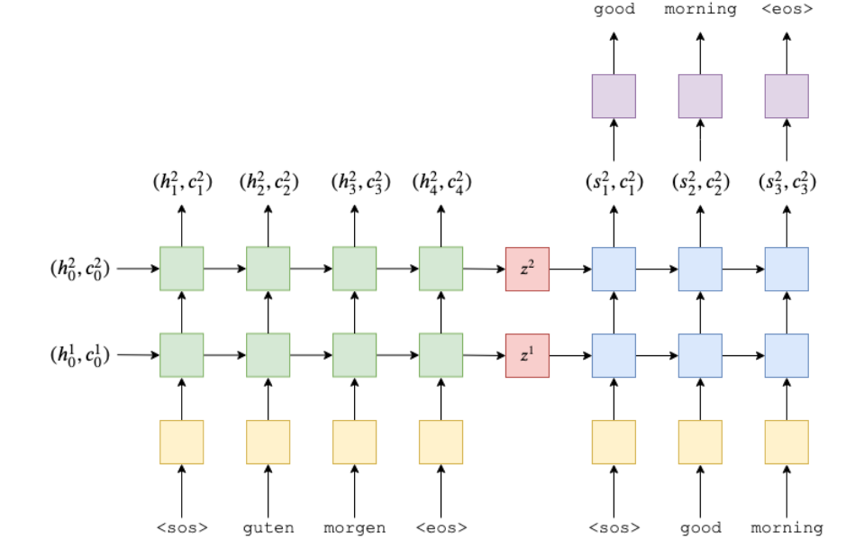

## Seq2Seq
### 模型架构
seq2seq是2014年随论文[[Sequence to Sequence Learning with Neural Networks](https://arxiv.org/abs/1409.3215)]发布
的一种NLG自然语言（生成式）模型， 下图直观展示了seq2seq模型在机器翻译任务（德译英）中，神经网络前向计算（Forwad Computiation）的工作流程

  
seq2seq模型的关键点在于， 将模型分成了编码器和解码器：  
编码器在编码阶段，会对每一个Token（上面的话是一个个的单词）进行**编码**，编码过程通常会使用RNN来实现(论文里使用的是LSTM， 所以会同时有hidden state和cell两个输出， 如果是最原始的RNN， 那么应该就只有一个hidden state)。   
解码器会沿用编码器的结构， 比如这里的编码器用的是双层的LSTM(论文里面是4层)， 那么解码器也会使用双层的LSTM， 同时解码器的最初的hidden state和cell刚好就是解码器的最后一步产出的hidden state和cell  
> hidden state的维度和cell的维度通常会一样


### 编码器
我们拆解一下整个seq2seq， 先只关注编码器这个部分


编码器前向计算涉及的公式：


> e指的是embedding词嵌入

也就是当我们使用一般的RNN模型时， 就是上面的公式， 如果是LSTM, 因为会涉及cell（记忆单元）所以会多一个参数。上面的公式没有涉及层级， 如果涉及多个层级（只有第一层会用到embedding）， 以LSTM模型为例， 公式为：


从第二层layer开始， 编码器的第一个参数变成了前一层的hidden state而不是embbeding

### 编码器pytorch实现

```python
class Encoder(nn.Module):
    def __init__(self, input_dim, embedding_dim, hidden_dim, n_layers, dropout):
        super().__init__()
        self.hidden_dim = hidden_dim
        self.n_layers = n_layers
        self.embedding = nn.Embedding(input_dim, embedding_dim)
        self.rnn = nn.LSTM(embedding_dim, hidden_dim, n_layers, dropout=dropout)
        self.dropout = nn.Dropout(dropout)

    def forward(self, src):
        embedded = self.dropout(self.embedding(src))
        outputs, (hidden, cell) = self.rnn(embedded)
        return hidden, cell
```  

> 这里注意负责前向计算逻辑的forward函数中参数src的形状是：输入句子长度（或者说token数）  * Bacth大小，因为LSTM会默认接受输入句子长度  * Bacth大小 * Embedding大小的输入， 虽然可以将Batch大小放到第一维度， 但是考虑到seq2seq其实是根据一个一个的token进行前向运算的运算的， 所以第一个维度是句子长度是更符合逻辑的， 相当于将token置于for loop的最外层（虽然可能不符合多数人的直觉）

Ok， 由于我们的Decoder只需要hidden state和cell， 所以forwar只输出hidden和cell

### 解码器
回过头来我们来关注解码器：  
  
其实解码器和编码器在结构上是非常相似的， 一个比较直观的区别在于：   解码器会在每个计算步骤产出的output之上构建一个全连接层， 然后输出的大小是词汇表的大小  

解码器的计算公式：  

> 这里的d其实就是目标输出的embedding layer, 类比编码器公式中的e； s就是hidden state类比编码器公式中的h

### 解码器pytorch实现
```python
class Decoder(nn.Module):
    def __init__(self, output_dim, embedding_dim, hidden_dim, n_layers, dropout):
        super().__init__()
        self.output_dim = output_dim
        self.hidden_dim = hidden_dim
        self.n_layers = n_layers
        self.embedding = nn.Embedding(output_dim, embedding_dim)
        self.rnn = nn.LSTM(embedding_dim, hidden_dim, n_layers, dropout=dropout)
        self.fc_out = nn.Linear(hidden_dim, output_dim)
        self.dropout = nn.Dropout(dropout)
        
    def forward(self, input, hidden, cell):
        input = input.unsqueeze(0)
        embedded = self.dropout(self.embedding(input))
        output, (hidden, cell) = self.rnn(embedded, (hidden, cell))
        prediction = self.fc_out(output.squeeze(0))
        return prediction, hidden, cell
```

在代码上， 解码器也是和编码器相似的（甚至rnn模型的参数也是一样的）， 当然也一些不同的地方：  

- forward的参数多了hidden和cell， 这个是encoder的输出
- input由于是一个个的token， 所以使用`input = input.unsqueeze(0)`补充了第一维度， 这是为了满足LSTM模型的输入需求
- prediction预测是构建在output之上的， 由于是第一维可有可无， 我们这里用squeeze压缩掉
### 完整seq2seq代码实现
```python
class Seq2Seq(nn.Module):
    def __init__(self, encoder, decoder, device):
        super().__init__()
        self.encoder = encoder
        self.decoder = decoder
        self.device = device
        assert encoder.hidden_dim == decoder.hidden_dim
        assert encoder.n_layers == decoder.n_layers
        
    def forward(self, src, trg, teacher_forcing_ratio):
        batch_size = trg.shape[1]
        trg_length = trg.shape[0]
        trg_vocab_size = self.decoder.output_dim
        outputs = torch.zeros(trg_length, batch_size, trg_vocab_size).to(self.device)
        hidden, cell = self.encoder(src)
        input = trg[0,:]
        for t in range(1, trg_length):
            output, hidden, cell = self.decoder(input, hidden, cell)
            outputs[t] = output
            teacher_force = random.random() < teacher_forcing_ratio
            top1 = output.argmax(1)
            input = trg[t] if teacher_force else top1
        return outputs
```
这里先解释一下上面的几个新变量：

- trg其实是target， 表示目标输出， 所以在结构上和input是相似的: 目标字符串长度(token数) * Batch大小
- teacher_forcing_ratio， 其实就是一个0到1的数值（表示概率）， 这个值表示使用上一步的真实值（ground truth）或者预测值作为下一步输入的概率， 显然易见这个值如果太大的话可能会导致过拟合

当我们把encoder和decoder的逻辑放在一起的时候， 我们能清晰地看到forwad中有一个for循环会沿着输出长度一步一步调用decoder， 然后将每一步的output填充到最后的结果outputs中；
> 注意， encoder在整个前向计算中只进行了一次！
